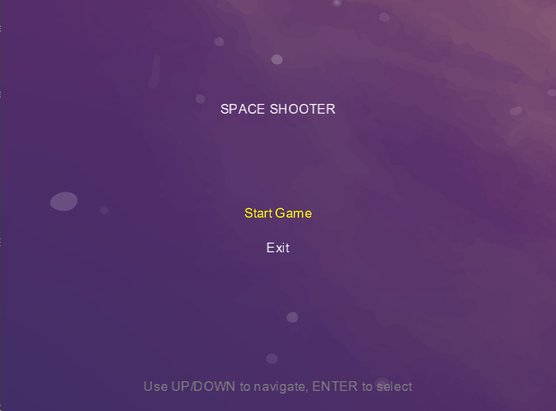
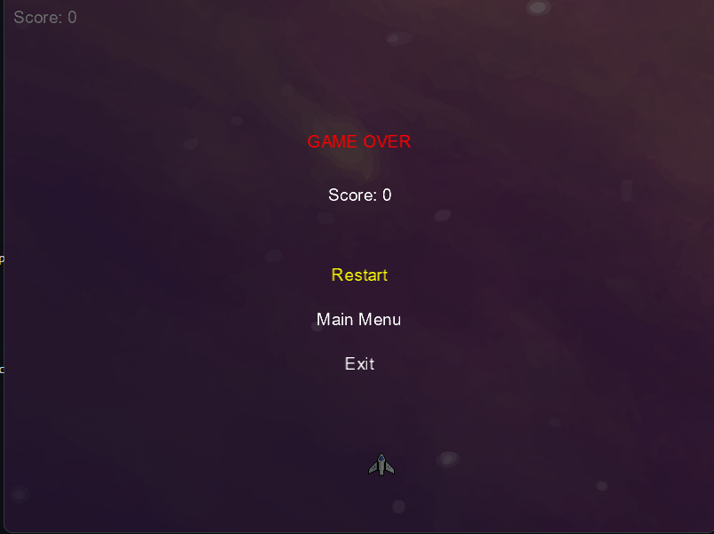
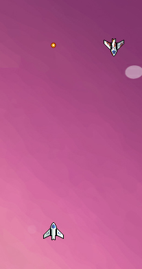

# Monogame---SpaceGame

Técnicas de Desenvolvimento de Jogos - 2ªFase:

Grupo : -> Gonçalo Sousa 22352

# Índice:

1 - Introdução	

2 - Movimentos e ações	

3 - Interface	

4 - Arte	

5 - Dificuldade	

6 - Sons e Música

7 - Conclusão

# 1 - Introdução:

Space Game é um jogo baseado nos jogos shooter espacial de arcade feito com a framework Monogame. Consiste em um jogo naves onde o objetivo do jogador é matar o número
máximo de naves que conseguir. Ao longo do jogo, para aumentar a dificuldade, os inimigos vão aparecendo cada vez mais rápido ficando assim mais dificil o jogador conseguir sobreviver.

# 2 - Movimentos e ações:

O jogador pode mover a nave para a esquerda e para a direita com as teclas "<-" e "->".
O jogador pode disparar um tiro clicando no "Space" ou segurar o mesmo para mandar tiros seguidos.

# 3 - Interface

Em termos de interface o jogador tem na sua tela acesso as suas estatisticas que guardam os seguintes dados:

•   Score - equivale ao numero de naves inimigas que o jogador destroi, a cada nave destruida equivale 100 pontos.

•   Vidas - no canto superior direito o jogador pode visualizar 3 corações que equivale à quantidade de vidas que o jogador tem, a cada nave que o jogador deixar passar ou bater contra o jogador perde 1 vida.

O jogo tem ainda um menu inicial onde o jogador pode escolher o começar o jogo ou sair do mesmo. Quando morre tem um menu onde pode recomeçar o jogo, voltar ao menu inicial ou sair do jogo

# 4 - Arte

Em termos de sprites, o jogo utiliza 3 sprites diferentes, 1 para o jogador, 1 para o inimigo e 1 para o tiro da nave.

# 5 - Dificuldade

Sendo um jogo de estilo arcade, foi adicionado um nível de dificuldade progressivo.

À medida que o jogador for progredindo no jogo a dificuldade vai aumentando no seguinte aspeto:

•   quando o jogador chegar aos 1500 pontos a velocidade de spawn dos inimigos aumenta, mas tambem aos 3000 pontos a velocidade de spawn de inimigos aumenta mais uma vez.

# 6 - Sons e Música

Para a parte dos sons, o jogo utiliza:

•   Música de fundo: Música que é ouvida no decorrer do jogo

•   Bullet Sound: é o efeito sonoro que toca quando o jogador disparar.

•   Explosion Sound: é o efeito sonoro que toca quando o jogador perder vidas e quando destruir uma nave inimiga.

# 7 - Conclusão

Chego ao final deste projeto para a disciplina de Técnicas de Desenvolvimento de Videojogos. Foi um percurso bastante desafiante, mas ao mesmo tempo foi enriquecedor.
Posso-me orgulhar do produto final apresentado.

Gostaria ainda de destacar a importância da primeira fase de analisar um jogo já existente, pois foi essencial para conseguir compreender as chaves para realizar um bom projeto tanto a nível de design como a nível de gameplay.